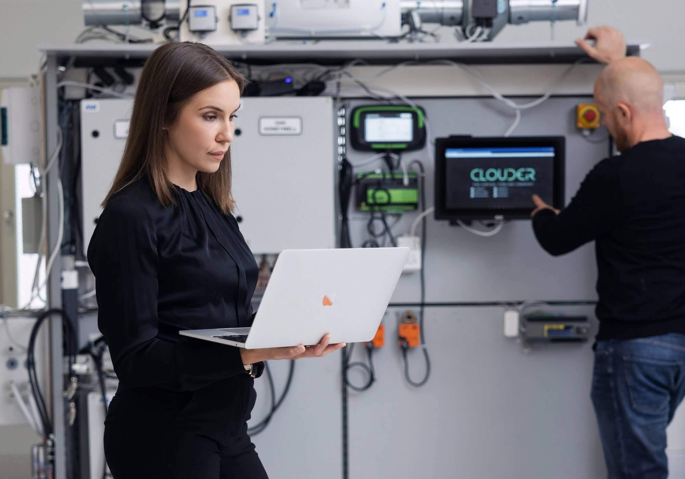

The Finnish technology company Clouder launched a new intelligent cabling solution that connects all the building's technical systems with virtual cables. Virtual cabling acts as the building's digital infrastructure, enabling data-driven management of the entire property cost-effectively and environmentally friendly.

Commercial properties can have more than 50 different technical systems and subsystems connected to thousands of field devices throughout the building. Currently, these systems and devices are interconnected with physical control cables, which limits flexibility and incurs unnecessary, significant costs over the building's life cycle. Clouder's comprehensive solution provides buildings with a smart infrastructure that connects and integrates all the building's technical systems using virtual cables.

Clouder's product consists of software connected to the building management system (BMS) and edge connector devices, forming a wireless and encrypted virtual cable network between all systems and field devices, such as heating and air conditioning systems. With virtual cabling, the signals from field devices are digitized, and the obtained data is transferred through the building's core network to a cloud service, enabling data-driven management and optimization of the entire property. The solution also includes an application developed by Clouder, which allows edge connector devices to be installed easily, quickly, and securely.

Clouder's virtual cabling makes connection management easy, safe, and flexible, while simultaneously reducing the amount of cables running through buildings by thousands of kilograms. Virtual cabling creates a flexible infrastructure for the building, allowing future modifications to be made to spaces without additional cabling, diamond drilling, and breaking fire stops. Clouder's virtual cabling can be installed in all commercial buildings, both new constructions and renovations, and integrates with all building management systems, protocols, and technologies.

"Clouder is revolutionizing the way building technical systems are connected. Virtual cabling offers a cost-effective and environmentally friendly solution for construction and renovations, as the system is quick to install and reduces the amount of control cables and waste needed by tons. At the same time, it significantly lowers the building's fire load," says Emma Grönlund, co-founder of Clouder.

## The Growth of Virtual Cabling Accelerated by New Energy Efficiency Directive

Buildings account for nearly 40 percent of the EU's energy consumption and produce over a third of all EU emissions, resulting in increased demands for building energy efficiency. The new EU energy efficiency directive, which came into effect in 2023, aims to reduce emissions in the construction sector and accelerate the adoption of smart technologies to optimize building energy efficiency.

"The potential for emission reduction in the industry is enormous, and green transition solutions are currently attracting property owners and builders. Our mission is to enable a more sustainable built environment and help property and construction sector players meet the increased regulatory requirements for energy efficiency and emission reductions," Grönlund says.

The energy efficiency directive also mandates the installation of mandatory automation and control systems in commercial properties. Although the accuracy and commercial use of simulation programs are constantly increasing, the gap between calculated and measured consumption remains significant because systems cannot be monitored centrally and in real-time without comprehensive data from different systems.

Clouder's virtual cabling solves the integration challenges of siloed building systems, as it allows data from all systems and field devices, such as heating, ventilation, and cooling systems, to be collectively utilized. As a result, the entire property can be managed centrally and data-driven, even exceeding directive requirements. Data from the solution also enables e.g. room-specific condition and energy usage optimization, which can reduce building’s energy consumption by 20-50 percent.