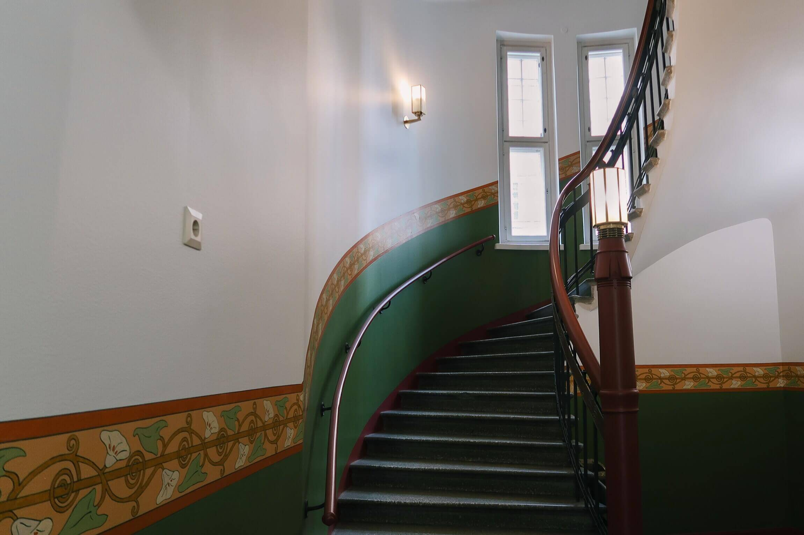

Kalevankatu 9 is a prestigious art nouveau building, partially protected by The Finnish Heritage Agency (SR-1), in Helsinki. For the owner, Conficap, saving energy is an important mission considering both sustainability and costs. Clouder’s integration and data platform provided significant energy savings and improvement in indoor conditions from day one and will be expanded in the building within future building tech renovations.

## Challenge

The client wanted to implement room-specific environmental monitoring in their historic property. Their goal was to reduce energy consumption, especially in the sauna facilities, by shifting from a time-based ventilation schedule to demand-based ventilation. Beyond saving energy, improving indoor conditions was also a priority. For instance, if the ventilation system switches off in the evening while the sauna remains in use until morning, conditions will not be ideal. Since the building is protected, installing new cabling would be both challenging and expensive.

> We’ve been struggling with these problems for a long time and everyone seems to come up with old school solutions and promises they can’t keep. Clouder was the first one to bring modern solutions that worked. Everything happened so fast and Clouder’s team reacted to our inquiries right away. We even get the data to our own spreadsheet just with the push of a button.
>
> Jani Pulkkinen, Construction Manager, Conficap

## Solution

We implemented a local LoRa indoor network, without any extra monthly costs, along with room sensors and the Clouder Dashboard. This provided a practical solution to the ventilation issues in the property's two sauna areas, which shared one ventilation unit. Previously, both saunas were ventilated continuously due to the impracticality of time-based scheduling and there was no desire to manage complex booking calendars.

To solve this issue two controllable dampers were installed in the ventilation system and added wireless environmental sensors to the saunas. These sensors transmit motion detection, CO2,  and humidity data to the building automation system. When motion is detected, ventilation is activated for that specific sauna and automatically shuts off one hour after users leave.

> The best part is that Clouder supports all connectivity modes, so we did not have to add useless low voltage cabling. In a protected historic building we can’t add cabling to the corridors or break walls and adding new systems with low voltage cabling would be almost impossible or at least extremely difficult and expensive, requiring a lot of planning.
>
> Jani Pulkkinen, Construction Manager, Conficap

## Implementation

Implementation was straightforward and fast. Within two weeks, sensors and Clouder’s Virtual Cabling Engine were installed and real-time data was available through the Clouder Dashboard.

## Outcomes

The introduction of Clouder has significantly reduced unnecessary use of the ventilation systems. **In the very first week,** **operating hours of the ventilation were cut in half**, and annual savings are expected to increase further, especially during the summer season when usage declines due to vacations. 

In addition, the system gave the client full visibility into all building automation data for the first time through the Clouder Dashboard. The owner can, for example, review trend data from each monitored point, and the ability to feed real data directly into the billing process via Clouder improves the property’s profitability.

> Clouder’s system is better than I could imagine. To think that we’ve had two machines going on 16 hours per day and now we’re able to save so much energy being able to control them in real time by the usage of the space. I bet our energy savings are more than 50% with this.
>
> Jani Pulkkinen, Construction Manager, Conficap
