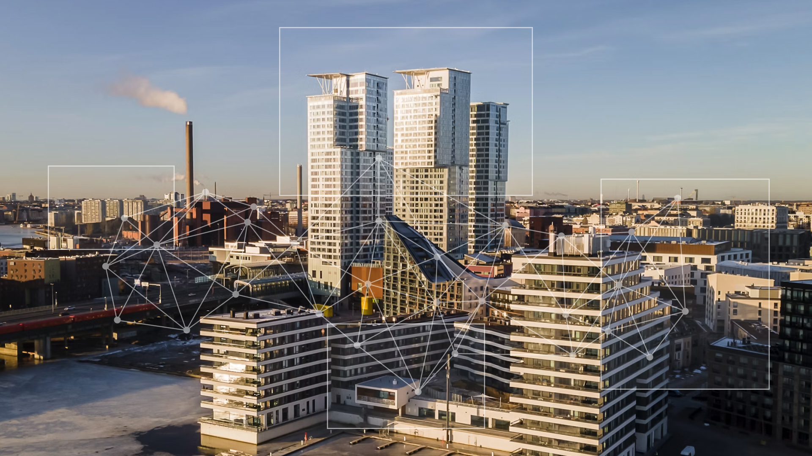

The construction industry has been living through a downturn. While many are waiting it out, some players are already building the future, and SRV is one of them. The company has made a deliberate push to develop data capabilities in their Public-Private-Partnership properties. They partnered with Clouder to do it.

Construction company SRV’s Energy and Lifecycle Services team has set an exceptionally high bar for both energy and operational efficiency. These buildings don’t just get managed, they are continuously optimized, with energy consumption, indoor conditions, and systems performance all held to tight parameters. Occupant comfort and air quality must always stay within the right boundaries, even as the building is being pushed toward peak efficiency. That balancing act demands a lot from data: it must be granular, timely, and trustworthy.

## The promise of AI rests on one condition

The era of AI has arrived in real estate, and the operational upside is unlike anything the sector has seen: fast commissioning, automatic optimization of conditions, predictive maintenance, minimized energy consumption, and AI that learns from a building's own data. But all this rests on a single condition: the data must be reliable, unified, and accessible.

Until now, the reality has been quite different. Multiple separate systems, each in their own silo, losing extremely valuable data on the way. Integrations struggle, reports have to be assembled manually, and the monthly numbers aren't ready until no one can remember where they came from.

## From fragmented architecture to a single source of truth

At the heart of the collaboration between Clouder and SRV’s Energy and Lifecycle Services team has been a transformation of the data architecture. Previously, data from the buildings was collected by several separate systems, each with its own logic and own format. The overall situation was difficult to manage and expensive to maintain.

Building a truly AI-ready architecture requires a rare combination of capabilities: local integrations that reach deep into building systems, robust data processing pipelines, analytical tools that turn raw data into actionable insight and above all, genuine understanding of how buildings and the real estate sector work. This isn't something you can bolt together in a single project. It's what Clouder has spent years building into a complete solution.

Clouder built a single, unified data infrastructure: one place with 100% data coverage across the properties it connects. The impact was immediate and concrete. Reporting that once took up to two weeks per building now takes 15 minutes, accurate from the first day of the month. This isn't just a tidier solution; it's a prerequisite for AI to do its job.

## The foundation is built and the interesting part begins

SRV’s Energy and Lifecycle Services team now has access to an unprecedented volume of usable, high-quality data at a fraction of the cost of traditional approaches. Operational efficiency has always been central to how the team works, but this unlocks an entirely new level: one where patterns emerge across an entire portfolio of buildings, where anomalies are caught before they become failures, and where every decision is grounded in real evidence.

As the data foundation matures, the possibilities multiply: AI models that predict energy demand hours ahead and shift consumption automatically when electricity prices drop or the grid needs relief, maintenance schedules driven by actual wear rather than calendar dates, indoor environments that adapt in real time to occupancy and weather. Buildings that don't just perform, they learn.

Operators who use this period to build that foundation will be in a very different position when the market turns and when AI starts to deliver on its promises in the real estate sector. The buildings of the future are intelligent. And intelligence needs data.

> We always had data, but getting real value out of it was another story. What changed was getting access to the actual source: clean, context-rich data that reflects what is truly happening across our properties. Now our team can use it, build on it and trust it. And in a world where AI capabilities are evolving fast, that kind of foundation matters more than any single tool.
>
> Jere Pirhonen, Director, Energy and Lifecycle Services, SRV

***

_[SRV’s Energy and Lifecycle Services team](https://www.srv.fi/en/for-developers/energy-and-lifecycle-services/) delivers Public-Private-Partnership property services under long-term contracts. Clouder turns building data into investment-grade asset intelligence, partnering with property owners, funds and operators to unlock hidden value across commercial real estate portfolios with industry-specific AI agents._
