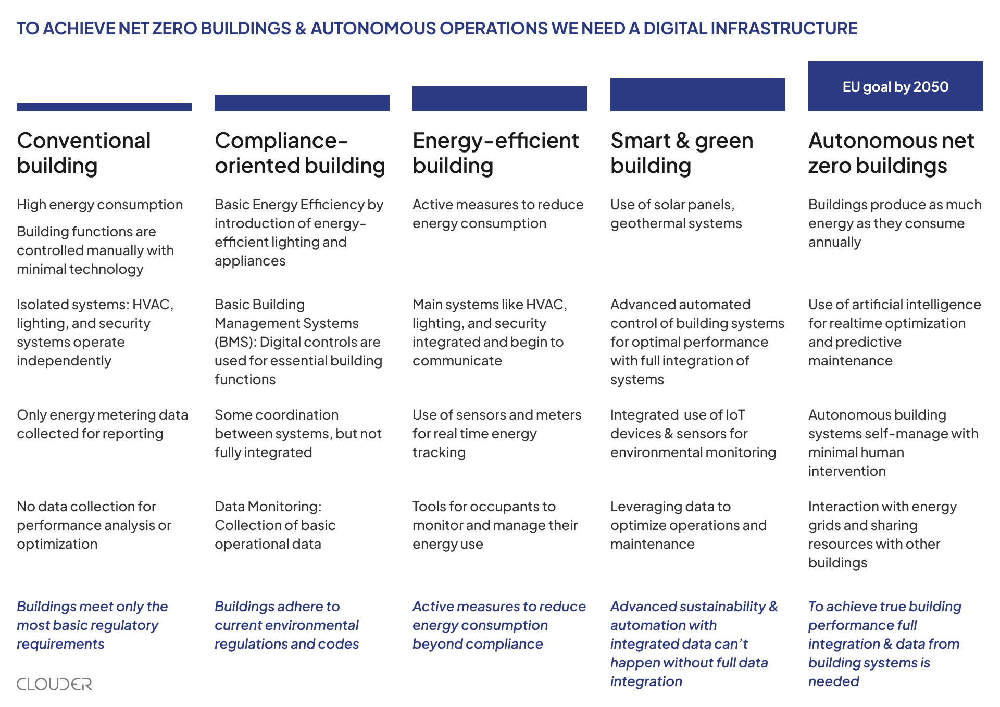

Imagine it’s year-end and you’re finalising yet another sustainability report. Pages of ESG data, meticulous compliance check-lists, a respectable GRESB score, yet your net operating income (NOI) hasn’t budged.

You're not alone. Many real estate fund managers and CFOs find themselves caught in a cycle of "reporting for reporting's sake", merely ticking ESG boxes to appease regulators and investors without seeing any real impact on their profit and loss statements. Shouldn't all that effort and those green initiatives translate into tangible financial benefits?

## Stuck in the reporting rut

Many real estate teams gather data quarterly, fill out templates, publish a glossy PDF, then file it away. Little wonder the process feels dry and disconnected from day-to-day value creation. It’s the _can’t‑see‑the‑forest‑for‑the‑trees_ problem: we measure so much that we lose sight of why we measure.

Early ESG work focused on avoiding penalties and meeting disclosure demands. Firms scrambled to comply with frameworks, while **the most valuable data for reducing operational expenses sit in siloed building systems**.

However, a revolution is underway. Forward-thinking asset managers are shifting their focus from mere ESG reporting to tangible energy performance, and they are experiencing significant rewards. These benefits include higher NOI, increased asset value, and enhanced portfolio resilience.

We’ve gathered steps on how to evolve from conventional buildings to compliance-oriented operations, then to energy-efficient, smart systems and ultimately begin the journey toward autonomy, delivering a transformative impact on NOI and asset value.

## Step 1: Measure and report accurately to see the inefficiencies

Reporting is usually the first step, but it does not in itself bring value. The value comes from using actual real time data from all available sources from the building. Leading fund managers now use modern data platforms that turn fragmented inputs into _investment-grade intelligence._

A performance enhancing building data platform should bring these capabilities:

*   **Unified data layer**: Utility meters, HVAC, automation, and sensors flow into a single dashboard, eliminating blind spots.
    
*   **Real-time benchmarking**: Every asset’s consumption is ranked against set targets and conditions.
    
*   **Actionable insights what causes inefficiencies**: Insights reveal anomalies instantly: a chiller stuck on manual override, lights burning overnight, simultaneous heating and cooling, automation devices not working as the graphic shows, etc.
    

Value comes from knowing **exactly how much energy is spent, what causes excess consumption, faulty conditions, or inefficient operations**. Uncovering inefficiencies in every layer stacks up as major savings that compound over time.

## Step 2: Use integrated data to optimize energy use

Heating, ventilation, and air-conditioning (HVAC) often consume 30–50% of a building's energy. This can be significantly reduced by optimizing energy usage with clear, unified data, even without bringing in AI optimizations.

Real-time building data is vital for quickly addressing operational issues. However, effective optimization first requires a solid data foundation and a clear understanding of what is being optimized. This prevents a "black box" scenario where reports simply state, "you saved 15% of normalized consumption, again!" Once existing systems are functioning correctly, owners can begin optimizing by adding missing sensors and properly integrating systems.

1.  Sensors collect live occupancy, temperature and CO₂.
    
2.  Integrate needed systems: e.g. ventilation is integrated with sensor data (not time based automation)
    
3.  Trimming idle use and waste with controls that adjust set-points in real time
    

Field studies show 20–30 % energy cuts and up to 50 % runtime reduction, with [Clouder’s customer cases](/news/case-example) matching those numbers. Savings directly increase NOI and extend equipment life, while emissions cuts lift GRESB scores.

## Step 3: Portfolio-level thinking and strategic investment

Once individual buildings are optimized with real-time data and smart systems, the next critical step is to leverage this intelligence across your entire portfolio. This is where the real financial upside lies, not just in isolated improvements, but in strategic, data-driven investment decisions that amplify savings, enhance asset value, and future-proof your portfolio.

### From single buildings to portfolio strategy

The insights gained from optimizing individual assets, such as energy savings, reduced maintenance costs, and improved tenant satisfaction, are powerful. But their full potential is unlocked only when applied at the portfolio level. By aggregating data across all assets, you can:

*   **Prioritize investments** where they deliver the highest NOI impact, whether through energy retrofits, smart technology deployments, or operational adjustments.
    
*   **Benchmark performance** to identify underperforming assets and replicate successes where they matter most.
    
*   **Allocate capital efficiently**, ensuring that every dollar spent on sustainability drives measurable returns in energy savings, asset valuation, and regulatory compliance.
    

### Close the loop on the whole portfolio: Measure → Manage → Improve at scale

*   **Measure**: Use a unified, vendor-agnostic platform to continuously track portfolio-wide performance. Monitor real-time metrics like energy consumption, carbon emissions, and cost savings to identify trends and outliers.
    
*   **Manage**: Proactively address inefficiencies across the portfolio with automated diagnostics and predictive maintenance. Fix issues before they escalate, reduce tenant disruptions, and keep energy waste in check.
    
*   **Improve**: Deploy your proven playbook systematically. Double down on high-ROI opportunities whether it’s scaling successful energy-saving measures, targeting assets with the greatest potential for valuation uplift, or mitigating risks in underperforming properties.
    

## Summary: Why does all this matter?

Regulators, investors, and tenants increasingly demand sustainability, but they reward performance. A portfolio-wide approach ensures that your investments in smart solutions and energy efficiency are not just tactical fixes but strategic moves that:

*   **Increased Net Operating Income (NOI)**: This is driven by reduced energy consumption, lower maintenance costs, and decreased vacancy rates.
    
*   **Future-proofed assets**: By mitigating risks and ensuring data accuracy, assets are prepared for evolving regulations, tenant demands, and market conditions over the next 5-10 years.
    
*   **Reduced transition risk & higher asset values**: Owners can avoid "brown discounts" and enhance asset values as regulations become stricter and the energy crisis intensifies.
    

The shift from compliance to performance is complete when sustainability becomes a core driver of financial success. The question isn’t _whether_ to invest in smart solutions, it's _where_ and _how fast_ you can scale them for maximum impact.