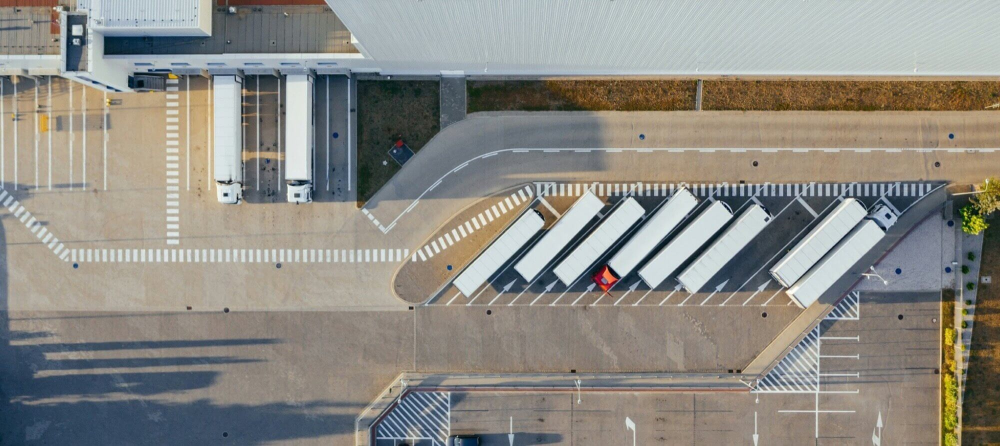

This is a case example of how Clouder effectively solved the challenges of sensor data transmission in a large logistics center by providing a solution that seamlessly integrated the data into a centralized monitoring system without expensive infrastructure modifications.

## Challenge

The client faced significant challenges in integrating sensor data into their centralized monitoring system. The existing infrastructure did not support seamless data integration from various sensors, and modifying the current system and cabling was not feasible due to cost and operational constraints.

## Solution

Clouder provided a sensor data transfer solution that integrated with the client's centralized data warehouse. Our solution enabled the expansion of the existing wired system by using sensors connected via RF communication, eliminating the need for long cable installations through the building.

### Implementation

- Initial demonstration
- Conducted a system demonstration in our lab.
- The customer described issues with transmitting measurements from their current BMS to the centralized data system.
- Presented Clouder's solution, which piqued the customer's interest.

### Technical meeting

- Held a technical meeting with the customer's experts.
- Discussed the solution's technical details and how to establish connectivity and a RF option was chosen.

### On-site visit

- Validated connectivity to all necessary locations within the distribution center.
- Ensured seamless data transfer from sensors to the centralized data warehouse.

### System setup

- Installed and configured the Clouder system onsite.
- Expansion of the existing wired system by using sensors connected via RF communication without long cable installations through the building.

## Outcome

The client was extremely satisfied with Clouder's solution, which resolved an issue that had persisted for the past months. The successful implementation allowed seamless integration of sensor data into their centralized monitoring system without the need for costly infrastructure modifications.

## Conclusion

Clouder's sensor data transfer solution provided a cost-effective and operationally efficient method to integrate diverse sensor data into the client’s centralized system, enhancing their data monitoring capabilities and overall operational efficiency.
