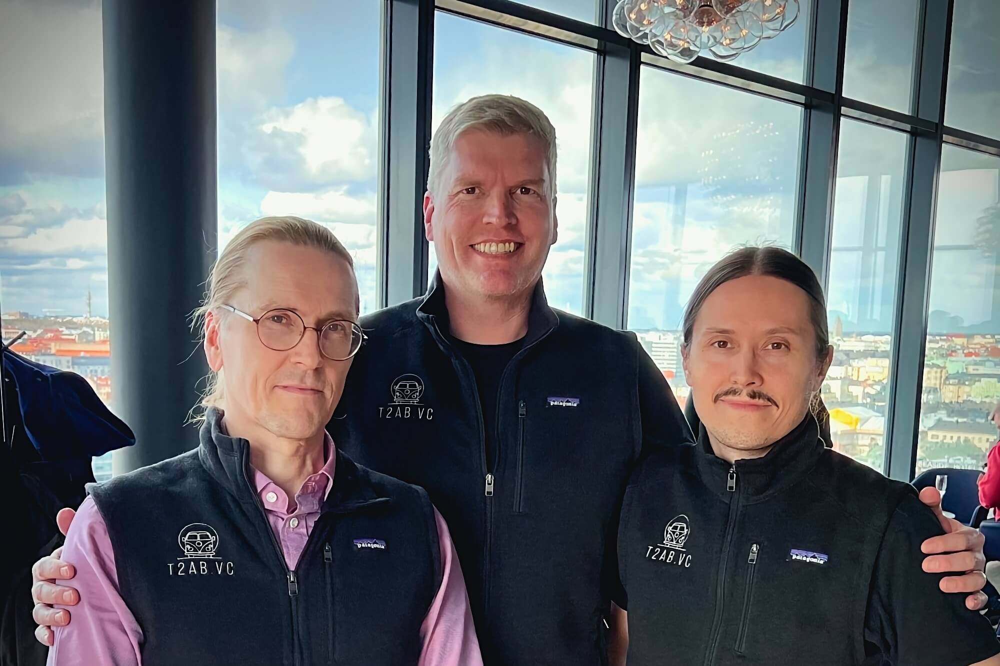

We’re extremely excited to announce that internationally renowned cyber security experts Mikko Hyppönen, Tomi Tuominen, and Henri Lindberg have joined Clouder as investors and active advisory board members. 

> We invested in Clouder because we are excited about solutions where IT meets the real world, those are game-changers by nature. Clouder bridges a significant gap in the real estate industry between the operational building technology world and data processing.  
– Tomi Tuominen

Mikko Hyppönen is a global security expert and a bestselling author. He works as the Chief Research Officer at WithSecure and as the Principal Research Advisor at F-Secure. He has written on his research e.g. for the New York Times, Wired and Scientific American. He has lectured at the universities of Stanford, Oxford and Harvard.

Tomi Tuominen works as the Chief Security Officer at Wolt. He is credited as one of the leading cyber security experts in the world. Tuominen specializes in protecting companies – often by breaching them before anyone else. He previously worked as the head of cybersecurity consulting at WithSecure and is the founder of t2 infosec conference. Together with Mikko, Tomi hosts one of the most popular podcasts in Finland, Herrasmiehakkerit, that shares insights of the latest trends in security.

Henri Lindberg has contributed significantly to the fields of cybersecurity and information security across multiple organizations. As a guest speaker at numerous events and a permanent advisory board member for the t2 infosec conference, Henri's expertise is widely recognized.

Mikko, Tomi, and Henri make the investment through their joint venture [T2AB.VC](https://t2ab.vc/)

> We’re very excited to get the best cyber security experts out there to join Clouder’s growth journey! With the advisory and experience from Mikko, Tomi, and Henri we can further focus our product’s relevant security features. Together we can bring more awareness to the commercial real estate industry about improving cyber security while getting real time access to accurate building data.  
– Tomi Grönlund, CEO & Founder at Clouder
