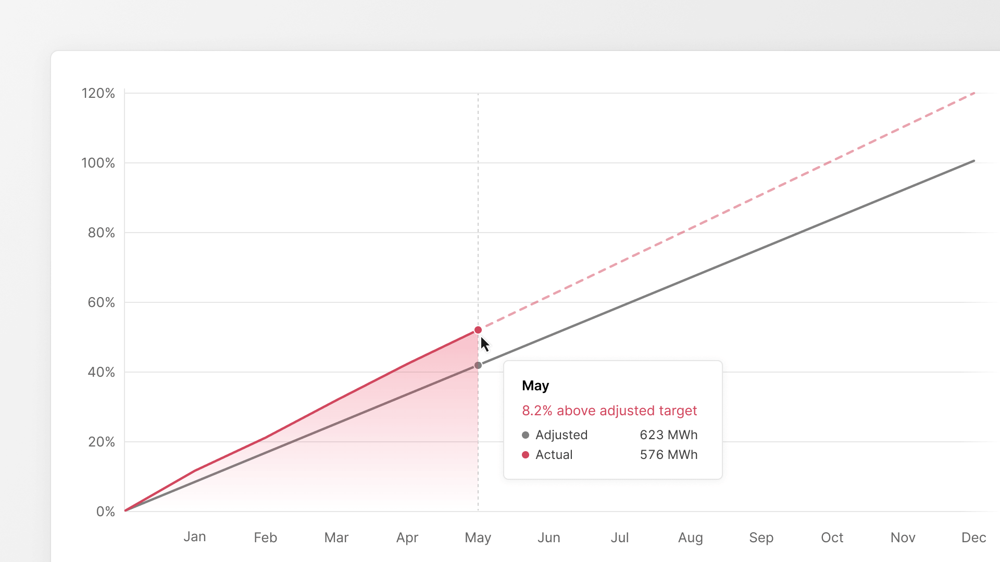

Fifteen years as a real estate investor taught me that the only value not tied to market movements is the value released from inside the asset itself. 

Every quarter, capital allocation in commercial real estate is dominated by one question: where is the market going? We model cap rate movements, debate interest rate paths, and reposition portfolios around forecasts. This is necessary work. AI is about to make us far better at it: sharper signals, faster reads, better-timed moves. 

But it has trained us to look in the wrong direction for our largest source of untapped value.

## Hidden value in a real estate portfolio is not in the market

The single biggest pool of hidden value in a real estate portfolio is not in the market. It is already inside the buildings you own.

Market-driven value has two properties that should make any allocator uneasy. It is **shared**, as every competitor sees the same signals and chases the same repricing, so the edge compresses the moment it appears. And it is **borrowed**, meaning you don't create it, you time it, which means it can be taken back as fast as it was given.

Operational value behaves the opposite way. It is **yours**, as it comes from how your specific assets actually run, which no competitor can see or replicate. And it is **durable**. Once you eliminate waste from a building, that NOI doesn't reverse when sentiment turns.

The reason this value stays hidden is simple: it has never been made visible. A building's true performance lives in its systems as raw consumption, but a consumption number alone isn't an insight. What's a lot? What's a little? So the data just sits there, siloed and fragmented. Attention flows to the market instead, because the market is the only thing we've been able to read clearly.

AI changes both sides of this equation, but not equally. Yes, AI will help you read the market more effectively. But that capability is available to everyone, so the advantage erodes. **The asymmetric opportunity is using AI to make the inside of your portfolio visible** and act on it in real time. That value is market-independent. It is there whether rates rise or fall. And almost no one is capturing it yet.

## Introducing the Performance Curve

Finding the hidden value is the hard part. It takes deep technical knowledge of how buildings actually run, and AI capable of turning raw signals into something you can act on. That is the work Clouder does. 

Seeing that value, judging how far an asset is from where it should be, and watching the gap close, should be effortless. That's why we built the Performance Curve: a model that answers what good actually looks like for each asset, and what it's costing you not to get there. Three things it gives an owner:

1. **Where you'll land.** Keep running the building the way you run it now, and the model projects where you end up at year-end, so the consequence of today's operating pattern is visible before the year is gone, not after.
2. **What inaction is costing you.** Not just the NOI gained by closing the gap, but the money leaking out every moment you don't. Framing the opportunity as an active, ongoing loss (and not a prize waiting to be claimed) is what makes the cost of inaction real. Every €1 of NOI recovered adds 20x asset value at a 5% cap rate.
3. **Performance that holds**. This is the end of project-after-project. Every action shows up against the baseline in real time, and the curve is kept where it should be. Performance is not a one-off optimization that decays, but a level held permanently.

The curve runs against a verified baseline, so every gain is measured rather than estimated. And a pilot building is typically live and showing its own curve within two weeks. Take a 20,100 m² commercial building where overconsumption was costing €189K in NOI annually. At a 5% cap rate, that's a €3.8M gap in asset value. The corrections become visible as the gap starts to close after the first half of the year. €3.8M created without buying a single new property.

Reading the market better with AI is table stakes now; everyone will have that. The durable edge belongs to allocators who also turn inward and treat operational performance as a measurable, capturable asset rather than an untracked cost. The value is already inside your portfolio. The Performance Curve is how you see it.
