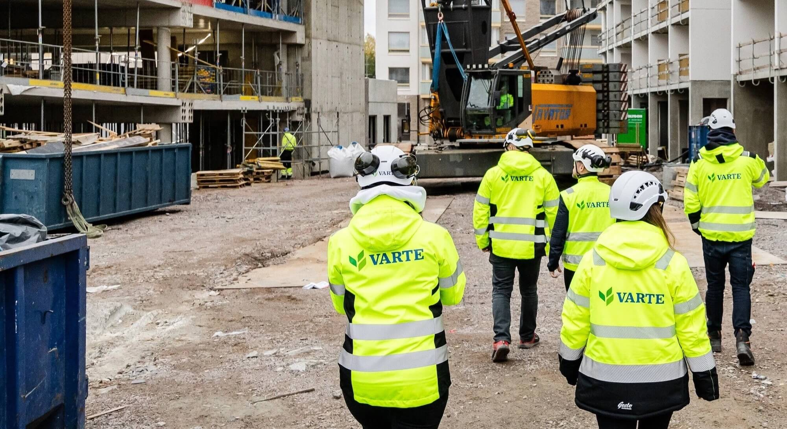

We’re pleased to announce that Varte, a construction company dedicated to sustainable building, has chosen to adopt Clouder’s technology in its upcoming construction project. By combining Clouder’s robust data infrastructure with Varte’s construction expertise, this collaboration showcases how digital and energy efficient buildings are constructed and  accelerates the industry’s transition towards truly sustainable buildings.

Varte’s goal is to be a forerunner in following the new standard for green building practices, one that minimizes environmental impact while adding to quality and security. By leveraging Clouder’s technology, Varte will optimize material usage, reduce cabling waste, and lower the carbon footprint of their project.

> It’s our priority to stay at the forefront of sustainable construction. Partnering with Clouder in this project ensures we remain agile, innovative, and prepared to meet the growing demand from environmentally conscious owners and occupiers.  
– Mikko Sirviö, Director of Varte’s Commercial Construction

Clouder shares Varte’s vision of a greener future:

> It’s crucial to consider an entire building’s lifecycle, not only the construction phase. Having worked as an owner and an investor, I’ve seen firsthand how short-sighted solutions can fall short in the long run. Together with Varte, we aim to ensure that buildings stands the test of time—for both owners and the planet.  
– Tomi Grönlund, CEO of Clouder

The joint project will be the construction of a new office building in Helsinki capital region, Finland. Clouder's virtual cabling will reduce construction costs and unnecessary cabling waste, while providing the owner with real-time data from all building tech systems while using the building. Real-time, accurate data enables building owners to monitor conditions and energy consumption, helping them meet net-zero targets and comply with relevant regulations.

> Traditionally, building systems and devices have been connected through complex cabling. Clouder’s solution replaces this outdated approach with a more advanced and reliable technology that we’re eager to evaluate in our upcoming project.  
– Mikko Sirviö, Director of Varte’s Commercial Construction
